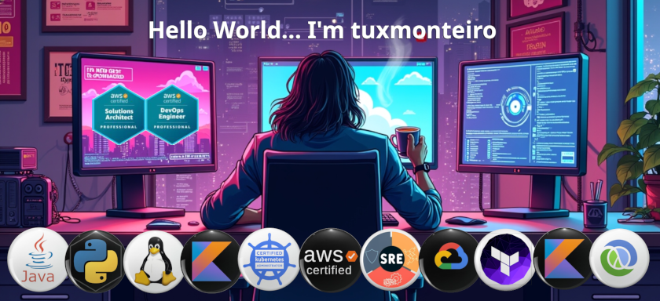

### 🗿 About Me  

I'm a **Cloud Architect** and **System/Software Engineer** passionate about **Cloud Computing, Cybersec, PaaS, backend development, and problem-solving** 😎. Deep experience in **Site Reliability Engineering (SRE)** improving several critical projects.
I love promoting an environment of critical thinking/data-driven approach, continuous learning and strong relationships.

### 🛠️ Tech Stack

- **Cloud Computing**: AWS (I'm AWS Certified Solution Architect Professional and DevOps Engineer Professional) and GCP
- **Software Engineer** : Java (using Functional and Reactive Programming (Project Reactor) and Spring framework), Python and Shell scripting expertise (but with experience with Ruby, Clojure, Kotlin, Go, and C++). I love BDD and profilers.
- **Kubernetes**: Using AWS EKS, GCP GKE, Rancher, Cilium, and more. In prehistory I used pure docker, but I'm currently a podman enthusiast.
- **Linux** since 1999 (**Red Hat Certified Engineer** in 2003) and currently in a love affair with Ubuntu. Proud sysadmin and kernel compiler in spare time.
- **SRE** - API first. Observability using open standards as OpenTelemetry. C4 model, RFC and ADR docs as the best way to discuss and record architectural design ideas and ensure that decisions and their context stand the test of time. Automation is the king (IaC with Terraform, setup with ansible, CI/CD and Universe as a code)

### ✨ What I Work On

- Learning new frameworks, new cloud and software architectures, Blockchain ideas, Rust and Scala languages, and AI-powered solutions.
- I'm using my free time to launch a new AI-powered financial asset management platform targeting the European market.

### ⚡ Fun fact

- My first graduation was Astronomy 🤓

### Stats

