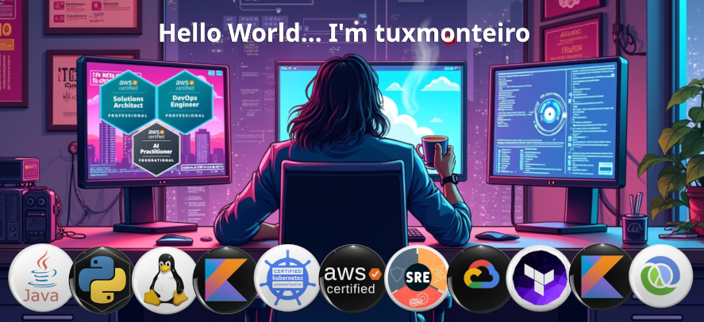

  
   
 

### 🗿 About Me  

I'm a **Cloud Architect** and **System/Software Engineer** passionate about **Cloud Computing, Cybersec, PaaS, backend development, and problem-solving** 😎. Deep experience in **Site Reliability Engineering (SRE)** improving several critical projects.

### 🛠️ Tech Stack

- **Cloud Computing**: AWS (I'm AWS Certified Solution Architect Professional and DevOps Engineer Professional) and GCP
- **Software Engineer** : Java (Functional approach, ProjectReactor and Spring framework enthusiast), Python and Shell scripting expertise (but with experience with Ruby, Clojure, Kotlin, Go, and C++). I love BDD and profilers.
- **Kubernetes**: Using AWS EKS, GCP GKE, Rancher, Cilium, and more. In prehistory I used pure docker, but I'm currently a podman enthusiast.
- **Linux** since 1999 (**Red Hat Certified Engineer** in 2003) and currently in a love affair with Ubuntu. Proud sysadmin and kernel compiler in spare time.

### 🎯 Projects experiences

- Cloud Automation with Terraform, Ansible, Pulumin. Observability using OpenTelemetry, NewRelic, Datadog, Prometheus, Grafana, and others.
- Low level networking and Multi-layer protocols using TCP, UDP, HTTP, SSL/TLS, Rest API, WebSocket, gRPC, and RSocket
- IaaS/PaaS Load Balancer (L4/7 Router, Reverse Proxy, CDN, API Gateway, more)
- Data Engineering (including ETL, Avro/Parquet Data Lake management, Spark infra, more)
- Kubernetes clusters as a Service and deployment pipeline. Deep experience with K8S Management
- Virtualization using KVM/XEN/Vmware
- Trading systems and stock simulator (using WebSockets and FIX protocols)

### ✨ What I Work On

- **Help tech teams**, promoting an environment of critical thinking/data-driven approach, continuous learning and strong relationships with the business.
- **Documentation Promoter** - Promoting C4, RFC and ADR docs as the best way to discuss and record architectural design ideas and ensure that decisions and their context stand the test of time.
- **Software Development** – Infra as Code, Automations, Backend engineering, Network engineering, APIs, and system design.
- **Cloud** – Improving cloud effciency, reliability and cost (strong experience with AWS, but also involved in projects using GCP and Azure)
- **Exploring** – New frameworks, new cloud and software architectures, Blockchain ideas, Rust and Scala languages, and AI-powered solutions.

## 🤜🤛 Let's Connect!  

💼 [LinkedIn](https://linkedin.com/in/marcelotmonteiro)  
🗣️ [discord](https://discord.gg/6Xffe5ph)
